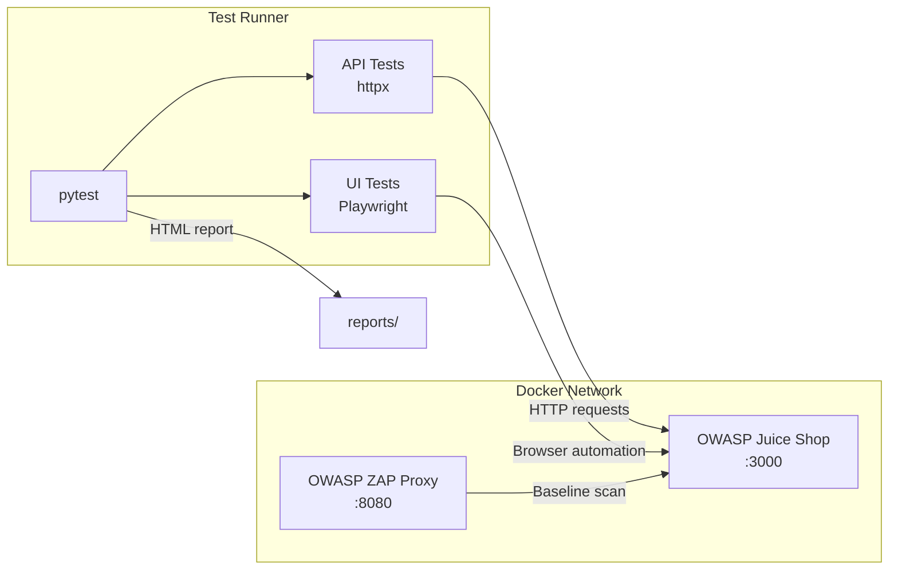

# OWASP Juice Shop Security Test Suite

[](https://github.com/<owner>/security-test-suite/actions/workflows/security-tests.yml)
[](https://www.python.org/downloads/)
[](LICENSE)
[-orange.svg)](https://owasp.org/Top10/)

Automated security test suite targeting [OWASP Juice Shop](https://owasp.org/www-project-juice-shop/) — a deliberately vulnerable web application. The suite validates defences against the OWASP Top 10 (2021) using **pytest**, **httpx**, and **Playwright**, all running against a Dockerised Juice Shop instance.

---

## Table of Contents

- [Architecture](#architecture)
- [OWASP Top 10 Coverage](#owasp-top-10-coverage)
- [Quick Start](#quick-start)
- [Prerequisites](#prerequisites)
- [Project Structure](#project-structure)
- [Configuration](#configuration)
- [Running Tests](#running-tests)
- [CI/CD Pipeline](#cicd-pipeline)
- [Reporting](#reporting)
- [Tech Stack](#tech-stack)
- [Contributing](#contributing)
- [License](#license)

---

## Architecture



```
pytest ──> httpx ──────────> Juice Shop (Docker :3000)
  │                                  ▲
  └──> Playwright (Chromium) ────────┘
                                     │
       OWASP ZAP (Docker :8080) ─────┘
```

---

## OWASP Top 10 Coverage

| # | OWASP Category | Test Module | Key Checks |
|---|---------------|-------------|------------|
| A01:2021 | Broken Access Control | `test_idor.py` | Basket/order/profile enumeration, write-access IDOR, unauthenticated access |
| A02:2021 | Cryptographic Failures | `test_sensitive_data_exposure.py` | Secrets in HTML/JS, console leaks, autocomplete on sensitive fields |
| A03:2021 | Injection | `test_sql_injection.py`, `test_xss.py`, `test_dom_xss.py` | Login/search SQLi, reflected/stored/DOM XSS, error message leakage |
| A04:2021 | Insecure Design | `test_login_security.py` | User enumeration via error messages, missing CSRF protection |
| A05:2021 | Security Misconfiguration | `test_security_headers.py`, `test_cors.py`, `test_clickjacking.py` | Missing headers, CORS origin reflection, X-Frame-Options, CSP |
| A07:2021 | Identification & Auth Failures | `test_authentication.py`, `test_rate_limiting.py` | Weak passwords, JWT manipulation, brute force, session management |
| A08:2021 | Software & Data Integrity | `test_authentication.py` | JWT 'none' algorithm, token tampering, signature bypass |
| A09:2021 | Security Logging & Monitoring | `test_rate_limiting.py` | Missing rate limiting detection (indicates no monitoring) |

---

## Quick Start

```bash
# 1. Clone the repository
git clone https://github.com/<owner>/security-test-suite.git
cd security-test-suite

# 2. Set up environment
cp .env.example .env
python -m venv .venv && source .venv/bin/activate  # Windows: .venv\Scripts\activate
pip install -r requirements.txt && playwright install chromium

# 3. Start Juice Shop
docker compose up juice-shop -d

# 4. Run tests
pytest
```

---

## Prerequisites

| Tool | Version | Purpose |
|------|---------|---------|
| Python | 3.11+ | Test runtime |
| Docker | 20.10+ | Container runtime |
| Docker Compose | v2+ | Service orchestration |
| Git | 2.30+ | Version control |

---

## Project Structure

```
security-test-suite/
├── .github/workflows/
│   └── security-tests.yml      # CI/CD pipeline
├── config/
│   └── settings.py             # Centralised configuration (env loading)
├── docs/
│   ├── ADDING_TESTS.md         # Guide for adding new test modules
│   ├── ARCHITECTURE.md         # Architecture decisions and diagrams
│   └── OWASP_COVERAGE.md       # Detailed OWASP Top 10 mapping
├── reports/                    # Generated test reports (git-ignored)
├── tests/
│   ├── conftest.py             # Shared fixtures (clients, auth, health checks)
│   ├── api/                    # API-level security tests
│   │   ├── test_authentication.py   # A07 – JWT, brute force, weak passwords
│   │   ├── test_cors.py             # A05 – CORS misconfiguration
│   │   ├── test_idor.py             # A01 – Broken access control
│   │   ├── test_rate_limiting.py    # A07 – Rate limiting
│   │   ├── test_security_headers.py # A05 – HTTP security headers
│   │   ├── test_sql_injection.py    # A03 – SQL injection
│   │   └── test_xss.py             # A03 – Reflected & stored XSS
│   └── ui/                     # Browser-based UI security tests
│       ├── conftest.py              # Playwright fixtures, screenshot on failure
│       ├── pages/                   # Page Object Models
│       │   ├── login_page.py
│       │   └── search_page.py
│       ├── test_clickjacking.py     # A05 – Clickjacking protection
│       ├── test_dom_xss.py          # A03 – DOM-based XSS
│       ├── test_login_security.py   # A04/A07 – Login security checks
│       └── test_sensitive_data_exposure.py  # A02 – Data exposure
├── utils/
│   ├── helpers.py              # API helper functions (register, login, tokens)
│   ├── payloads.py             # Security test payloads by vulnerability type
│   └── validators.py           # Assertion helpers for security checks
├── .env.example                # Environment variable template
├── .gitignore                  # Git exclusions
├── .pre-commit-config.yaml     # Pre-commit hooks (ruff, black, mypy)
├── CLAUDE.md                   # AI assistant project context
├── docker-compose.yml          # Juice Shop + ZAP services
├── LICENSE                     # MIT license
├── Makefile                    # Common task shortcuts
├── pyproject.toml              # Project metadata, ruff & mypy config
├── pytest.ini                  # Pytest markers and options
├── README.md                   # This file
├── requirements.txt            # Runtime dependencies (pinned)
└── requirements-dev.txt        # Development dependencies (pinned)
```

---

## Configuration

Copy the example environment file and adjust as needed:

```bash
cp .env.example .env
```

The `.env` file contains all configurable values (URLs, timeouts, credentials for the test target). **Never commit the `.env` file** — it is git-ignored by default. See [.env.example](.env.example) for all available variables and their descriptions.

---

## Running Tests

```bash
# All tests
pytest

# API tests only
pytest tests/api/ -v

# UI tests only
pytest tests/ui/ -v

# Specific vulnerability category
pytest -m sqli          # SQL injection
pytest -m xss           # Cross-site scripting
pytest -m auth          # Authentication
pytest -m idor          # Broken access control
pytest -m headers       # Security headers

# Critical findings only
pytest -m critical

# Smoke tests (fast subset)
pytest -m smoke

# With HTML report
pytest --html=reports/report.html --self-contained-html

# Parallel execution
pytest -n auto
```

---

## CI/CD Pipeline

The GitHub Actions workflow (`.github/workflows/security-tests.yml`) runs on every push to `main`/`develop`, on pull requests, and weekly on Monday at 06:00 UTC.

**Pipeline steps:**
1. Start Juice Shop as a Docker service
2. Install Python dependencies and Playwright browsers
3. Run API security tests
4. Run UI security tests (headless Chromium)
5. Generate HTML report
6. Upload report and failure screenshots as artifacts

---

## Reporting

After each test run, an HTML report is generated at `reports/report.html`. The report includes:

- Test results grouped by OWASP category
- Pass/fail status with detailed assertion messages
- Timing information for each test
- Screenshots for failed UI tests (attached as artifacts in CI)

Open locally:
```bash
make report
# or
open reports/report.html
```

---

## Tech Stack

| Technology | Version | Purpose |
|-----------|---------|---------|
| [pytest](https://docs.pytest.org/) | 8.3.x | Test framework |
| [httpx](https://www.python-httpx.org/) | 0.28.x | HTTP client for API tests |
| [Playwright](https://playwright.dev/python/) | 1.49.x | Browser automation for UI tests |
| [OWASP Juice Shop](https://owasp.org/www-project-juice-shop/) | latest | Vulnerable test target |
| [OWASP ZAP](https://www.zaproxy.org/) | stable | DAST baseline scanner |
| [Docker Compose](https://docs.docker.com/compose/) | v2 | Service orchestration |
| [PyJWT](https://pyjwt.readthedocs.io/) | 2.9.x | JWT token manipulation |
| [pydantic-settings](https://docs.pydantic.dev/latest/concepts/pydantic_settings/) | 2.x | Typed configuration |
| [ruff](https://docs.astral.sh/ruff/) | 0.8.x | Linting and formatting |

---

## Contributing

1. Fork the repository
2. Create a feature branch (`git checkout -b feat/new-test-module`)
3. Follow existing conventions (see [docs/ADDING_TESTS.md](docs/ADDING_TESTS.md))
4. Ensure all tests pass: `pytest`
5. Run linting: `ruff check . && ruff format --check .`
6. Commit using [Conventional Commits](https://www.conventionalcommits.org/): `feat:`, `fix:`, `test:`, `docs:`, `ci:`
7. Open a pull request against `main`

---

## License

This project is licensed under the MIT License — see the [LICENSE](LICENSE) file for details.

---

> **Disclaimer:** This test suite is designed for **authorized security testing** against OWASP Juice Shop running in a local Docker container. Never use these tests against systems you do not own or have explicit permission to test.
