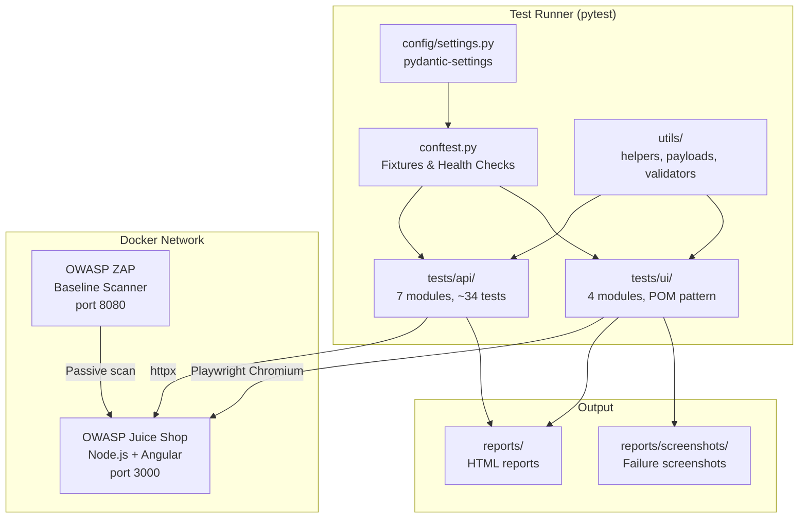

# Architecture

## Overview

This project is a **security test suite** that validates OWASP Juice Shop against the OWASP Top 10 (2021). It uses pytest as the test runner with two test layers:

- **API tests** — direct HTTP requests via httpx
- **UI tests** — browser automation via Playwright

Both layers target a Dockerised Juice Shop instance. Optionally, OWASP ZAP performs a passive baseline scan.

## Architecture Diagram



## Component Responsibilities

| Component | Purpose |
|-----------|---------|
| `config/settings.py` | Loads `.env`, validates config, exposes typed `Settings` object |
| `tests/conftest.py` | Session-level fixtures: HTTP clients, auth tokens, health checks |
| `tests/api/` | API security tests — one module per vulnerability category |
| `tests/ui/conftest.py` | Playwright browser lifecycle, screenshot-on-failure hook |
| `tests/ui/pages/` | Page Object Models (LoginPage, SearchPage) |
| `tests/ui/` | Browser-based UI security tests |
| `utils/helpers.py` | API interaction helpers (register, login, token management) |
| `utils/payloads.py` | Centralised attack payloads by vulnerability type |
| `utils/validators.py` | Reusable assertion helpers for security checks |

## Data Flow

```
1. pytest starts → conftest.py loads settings from .env
2. Health check verifies Juice Shop is reachable (HTTP GET to /rest/admin/application-version)
3. Session-scoped fixtures create HTTP clients and admin tokens
4. API tests send crafted payloads via httpx → Juice Shop REST API
5. UI tests launch headless Chromium via Playwright → Juice Shop Angular frontend
6. Each test asserts that the application correctly defends against the attack
7. Results are collected into an HTML report; screenshots are saved on failure
```

## Technology Decisions

| Decision | Choice | Rationale |
|----------|--------|-----------|
| Test framework | **pytest** over unittest | Fixtures, parametrize, markers, rich plugin ecosystem |
| HTTP client | **httpx** over requests | Async support, HTTP/2, modern API, better timeout handling |
| Browser automation | **Playwright** over Selenium | Faster, auto-wait, built-in network interception, better CI support |
| Configuration | **pydantic-settings** over raw os.getenv | Type safety, validation, SecretStr for credential masking |
| Target app | **OWASP Juice Shop** | Industry-standard vulnerable app, covers all OWASP Top 10 categories |
| Containerisation | **Docker Compose** | Reproducible environment, CI-friendly, network isolation |

## Security Considerations

- All tests run against a **local Docker container** — never against production systems
- Credentials are loaded from `.env` (git-ignored) and masked with `SecretStr`
- CI uses GitHub Secrets for any sensitive environment variables
- Test payloads are for **authorised security testing** only
